# What is machine learning?
- field of study that gives computer ability to learn without being explicitly programmed 

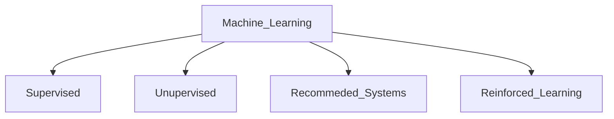

## Supervised Learning 

```
X ( input ) -> Y ( output ) mapping
```
- learns from "right answers"

| Input | Output | Application |
|----------|----------|----------|
| email   | spam (0/1)  | spam filtering   |
| audio    | text transcript   | speech recognition   |
| English   | Hindi   | machine translation   |
| id, user_info | click(0/1) | recommendation ad|


### 1. Regression 
- predict a number or quantity as output 
- infinitely many possible output 

- eg: Housing price prediction 


### 2. Classification 
- predict categories 
- small number of possible output 

- eg: Breast cancer detection 


## Unsupervised Learning 

- find something interesting in unlabelled data 
- learns without human supervision
- patterns, structure 

### 1. Clustering 
For raw unlabelled data and breaking it into groups based on differences and similarity 

Types:
1. exclusive - single data point can only exist in one cluster, K-means clustering : partition data points into K of clusters

2. overlapping - single data point can exist in 2 or more clusters with different degree of membership

3. hierarchical - distict cluster division based on similarities, merged and organised based on hierarchical relationships 

4. probabilistic - grouped into clusters based on probability of each data point belonging to each cluster 

Example:
- Google news: grouping related stories together 
- DNA microarray
- Grouping customers 

### 2. Association 
- correlations and co-occurrences within the data 
- connections between data objects 
- Eclat , FP - growth algorithms 

Example:
- purchased items together on retail 
- specific diagnosis from past patient cases  


### 3. Dimension reduction 
- extracts important features from the dataset
- reducing the number of irrelevant or random features present. ( data inputs )
- principle component analysis (PCA) and singular value decomposition (SVD) algorithms 

- compress data 

# Regression Model 

- House Price Prediction 
- getting a value as output 
- supervised learning model : data "right answers"

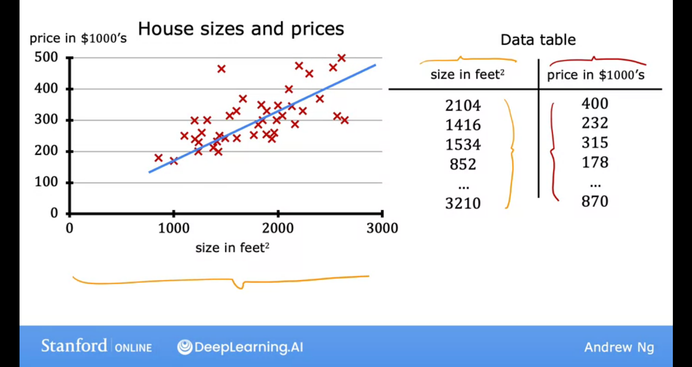

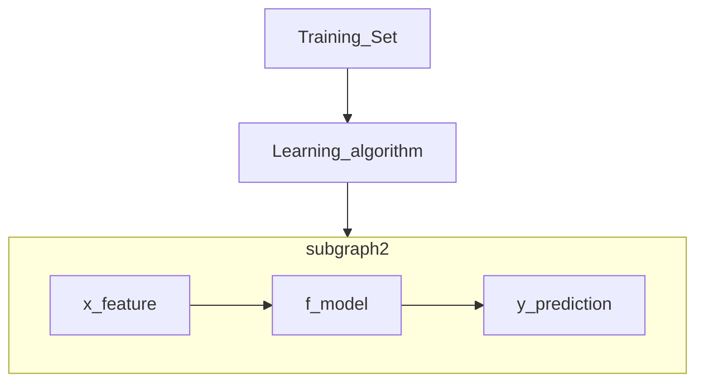


### Cost Function
https://medium.com/@yennhi95zz/3-understanding-the-cost-function-in-linear-regression-for-machine-learning-beginners-ec9edeecbdde


| General Notation | Description |
|----------|----------|
| a   | scalar  |
| **a**    | vector   | 
| x   | Training feature values   |
| $ x^{i} , y^{i} $ | i th training Example | 
| m  | number of training  | 
| w  | weight | 
| b  | bias | 
| $ f_{w,b} (x^i )$  | Model evaluation | 

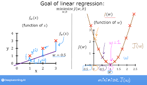

$$ J(w,b) = 1/2m * \sum_{i=1}^m ( f_{w,b}(x^i) - y^i)^2 $$


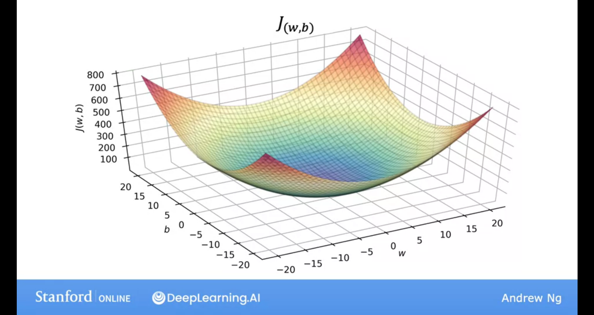


# Gradient Descent 

- training linear regression 
- we want $$ min_{w,b} J(w,b) $$
- For linear regression or any function 

1. Start with some w,b, common choice to set both to 0 
2. Keep changing w,b to reduce J(w,b)
3. Until we settle at or near a minimum 

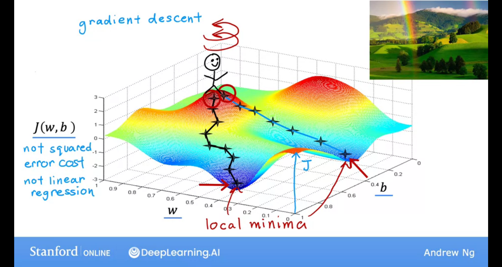


[Notes on gradient descent](https://towardsdatascience.com/gradient-descent-algorithm-a-deep-dive-cf04e8115f21#:~:text=Gradient%20descent%20(GD)%20is%20an,e.g.%20in%20a%20linear%20regression)

- iterative first-order optimisation algorithm 
- find local minimum or maximum of a given function 
- to minimise a cost or loss function 


### Function requirements 
- differentible 
- convex 


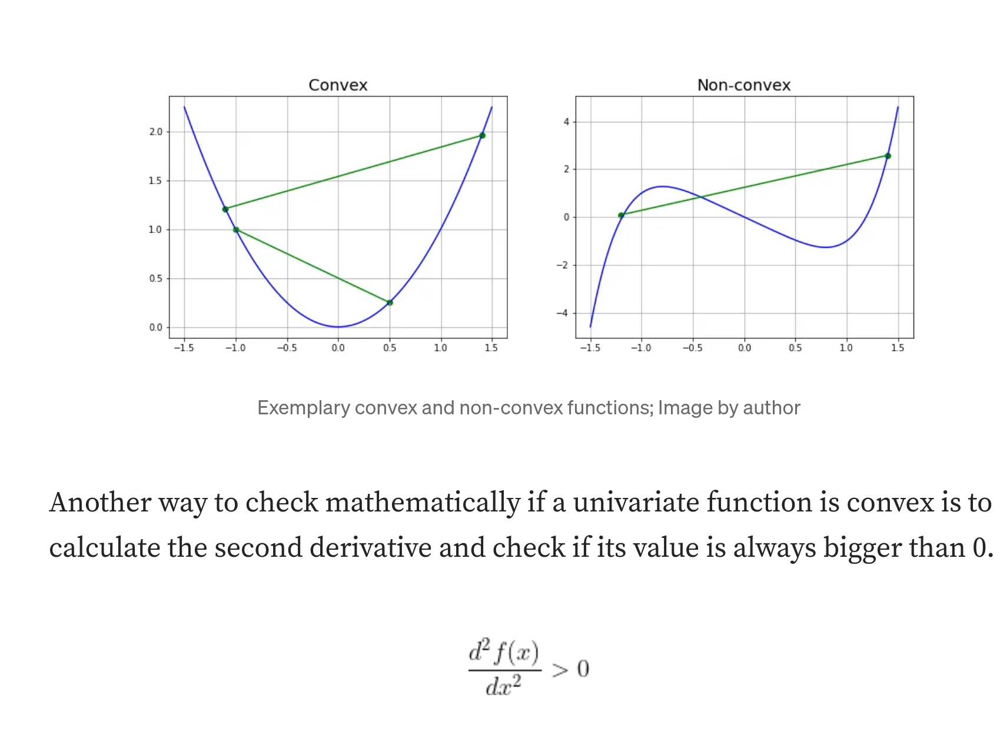

### Algorithm 

1. choose a starting point (initialisation)
2. calculate gradient at this point
3. make a scaled step in the opposite direction to the gradient (objective: minimise)
4. repeat points 2 and 3 until one of the criteria is met:

    a. maximum number of iterations reached

    b. step size is smaller than the tolerance (due to scaling or a small gradient) 

This function takes 5 parameters:

1. starting point [float] - in our case, we define it manually but in practice, it is often a random initialisation

2. gradient function [object] - specified before-hand and passed to the GD function

3. learning rate [float] - scaling factor for step sizes

4. maximum number of iterations [int]

5. tolerance [float] - to conditionally stop the algorithm 


### Equations 

$$ temp_ w = w - \alpha \frac{\mathrm{d} }{\mathrm{d}w} J(w,b)
 $$


$$ temp_ b =  b - \alpha \frac{\mathrm{d} }{\mathrm{d}w} J(w,b) $$

$$ w = tmp_w $$

$$ b = tmp_b $$

## Learning Rate and Gradient descent Intuiton

$$ \alpha $$

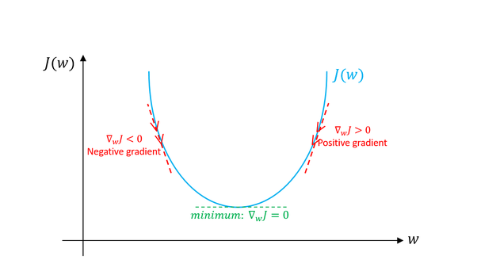


- If learning rate is too small then , the number of steps to get to the minimum will increase, making the gradient descent slow. 


- If learning rate is too large then , the steps will be large while updation making the cost worse at some cases, overshoot never reach minimum, failing to coverge, may diverge.

### Can reach local minimum with fixed learning rate 

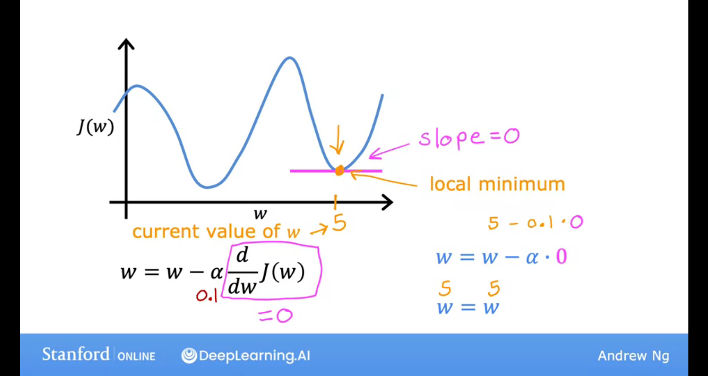


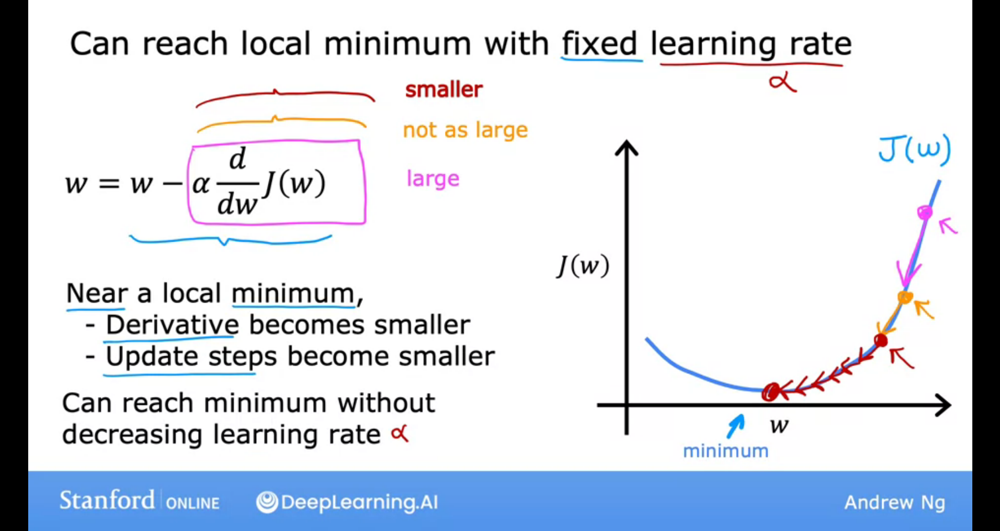

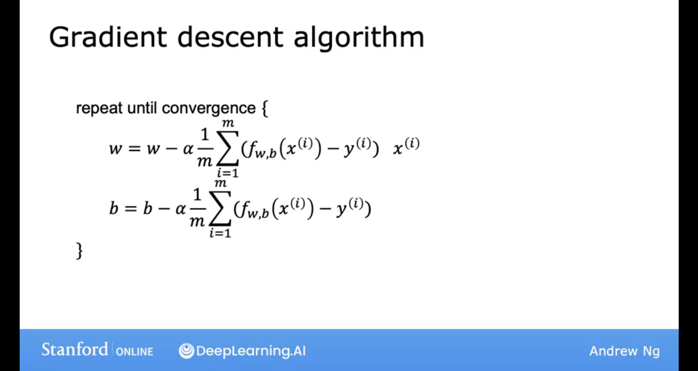


