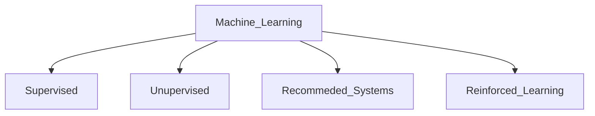
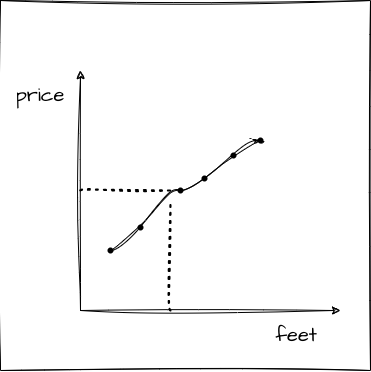
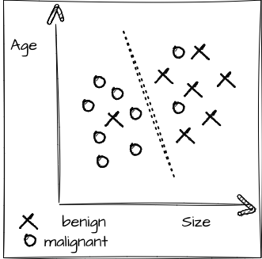

# What is machine learning?
- field of study that gives computer ability to learn without being explicitly programmed 



## Supervised Learning 

```
X ( input ) -> Y ( output ) mapping
```
- learns from "right answers"

| Inout | Output | Application |
|----------|----------|----------|
| email   | spam (0/1)  | spam filtering   |
| audio    | text transcript   | speech recognition   |
| English   | Hindi   | machine translation   |
| id, user_info | click(0/1) | recommendation ad|


### 1. Regression 
- predict a number or quantity as output 
- infinitely many possible output 

- eg: Housing price prediction 




### 2. Classification 
- predict categories 
- small number of possible output 

- eg: Breast cancer detection 




## Unsupervised Learning 

- find something interesting in unlabelled data 
- learns without human supervision
- patterns, structure 

### 1. Clustering 
For raw unlabelled data and breaking it into groups based on differences and similarity 

Types:
1. exclusive - single data point can only exist in one cluster, K-means clustering : partition data points into K of clusters

2. overlapping - single data point can exist in 2 or more clusters with different degree of membership

3. hierarchical - distict cluster division based on similarities, merged and organised based on hierarchical relationships 

4. probabilistic - grouped into clusters based on probability of each data point belonging to each cluster 

Example:
- Google news: grouping related stories together 
- DNA microarray
- Grouping customers 

### 2. Association 
- correlations and co-occurrences within the data 
- connections between data objects 
- Eclat , FP - growth algorithms 

Example:
- purchased items together on retail 
- specific diagnosis from past patient cases  


### 3. Dimension reduction 
- extracts important features from the dataset
- reducing the number of irrelevant or random features present. ( data inputs )
- principle component analysis (PCA) and singular value decomposition (SVD) algorithms 

- compress data 