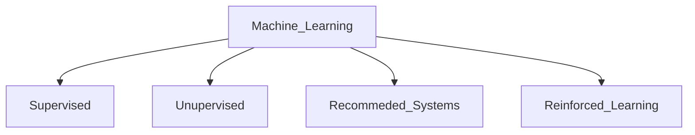

# What is machine learning?
- field of study that gives computer ability to learn without being explicitly programmed 



## Supervised Learning 

```
X ( input ) -> Y ( output ) mapping
```
- learns from "right answers"

| Inout | Output | Application |
|----------|----------|----------|
| email   | spam (0/1)  | spam filtering   |
| audio    | text transcript   | speech recognition   |
| English   | Hindi   | machine translation   |
| id, user_info | click(0/1) | recommendation ad|


### Regression 
- predict a number or quantity as output 
- infinitely many possible output 

- eg: Housing price prediction 


### Classification 
- predict categories 
- small number of possible output 

- eg: Breast cancer detection 


## Unsupervised Learning 

- find something interesting in unlabelled data 
- patterns, structure 

### Clustering 
- Google news: grouping related stories together 
- DNA microarray
- Grouping customers 

### Anomaly detection 
- fraud detection 

### Dimension reduction 
- compress data 